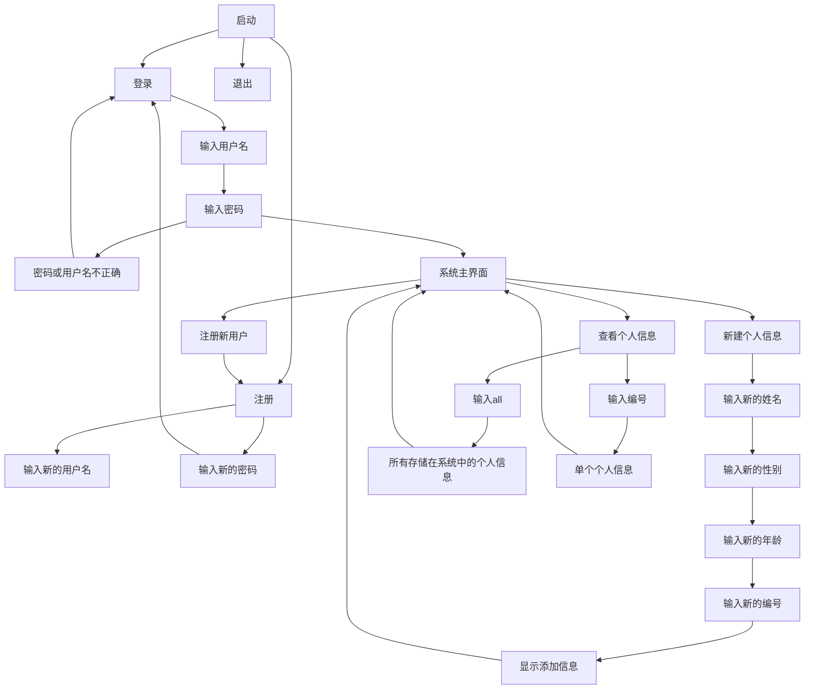

# 个人信息管理系统
## Personal information management system
## 一、软件环境：
?style=plastic&logo=python&logoColor=rgb(255%2C255%2C255)&label=%E7%BC%96%E5%86%99%E7%8E%AF%E5%A2%83&labelColor=rgb(91%2C91%2C91)&color=rgb(44%2C125%2C255)&cacheSeconds=3600)
?style=plastic&logo=windows&logoColor=rgb(255%2C255%2C255)&label=%E7%BC%96%E5%86%99%E7%8E%AF%E5%A2%83&labelColor=rgb(91%2C91%2C91)&color=rgb(7%2C128%2C216)&cacheSeconds=3600)
?style=plastic&logoColor=rgb(255%2C255%2C255)&label=%E7%BC%96%E8%BE%91%E5%99%A8&labelColor=rgb(91%2C91%2C91)&color=rgb(34%2C168%2C242)&cacheSeconds=3600&link=https%3A%2F%2Fcode.visualstudio.com%2Fdownload)

## 二、程序运行流程图：

## 、预设账户和密码：
| 账户      | 密码      |
| :-----------: | :-----------: |
| admin      | 123456       |

## 、如何下载？
- 在仓库中直接下载：
  - 1.打开dist文件夹
  - 下载exe文件
- 单击下列按钮下载：
  - 
